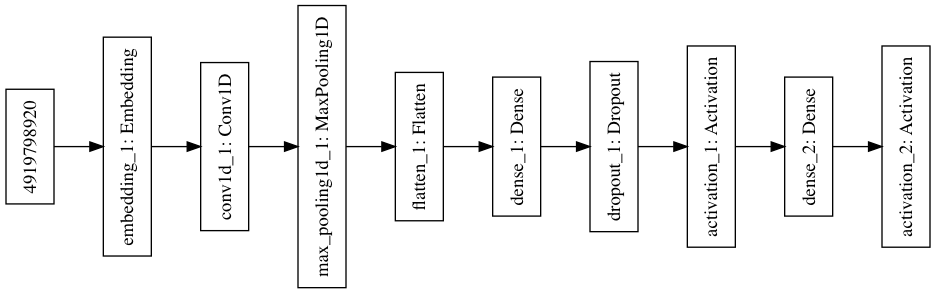
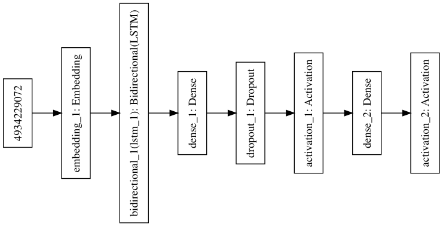

# Hate Speech Recognition
This repository contains necessary code to train a CNN and RNN for detecting hate speech. Please read the [document](data_mining_report.pdf "Tech report") for detailed descriptions.

## Introduction
This project is to build up a data mining system, utilizing natural language processing technnique and deep learning knowledge. Specifically, we 
- process tweets by stemming, tokenlizing and etc
- utilize pretrained Google (Mikolov) word embedding to extract features from tweets
- build up a CNN and RNN via Keras.

## Architecture
We design a CNN as follow:

We design a RNN as follow:

## Contact
If you have any questions towards code, please feel free to contact Jinmei Zheng at jmzhengkong@gmail.com.
